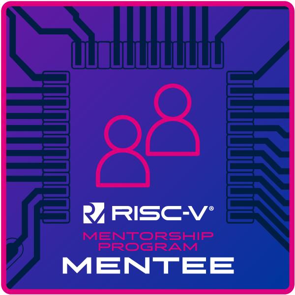

# 👨‍💻 Rishikesh Bhatt

**Software Engineer** | **Security Enthusiast**

Hi there! I'm Rishikesh, a software engineer and security enthusiast with a strong passion for low-level programming, operating systems, distributed systems, and reverse engineering. I thrive on solving challenging problems and building robust systems, whether it's through C/C++, Python, or other technologies.

---

## 📚 **Education**
- **University of Florida** 
  - Master of Science in Computer Science (GPA: 3.84/4.0)
- **Dhirubhai Ambani Institute of Information and Communication Technology** *(Aug 2015 – July 2019)*
  - Bachelor of Technology in Information and Communication Technology (CGPA: 7.31/10.0)

---

## 💻 **Skills**

### **Programming Languages**
- C/C++, Python, Assembly (x86, ARM, RISC-V), Go, SQL, Pony

### **Technologies**
- CMake, Pytest, Gtest, Pytorch, Google Protocol Buffers (gPB), YANG, gRPC, QEMU, Radare2, Git

## 🏆 Certifications

---

## 🌟 **Interests**
- Low-level programming
- Distributed systems
- Operating systems

---

## 📫 **Get in Touch**
- Email: [bhattrishi8@gmail.com](mailto:bhattrishi8@gmail.com)
- LinkedIn: [linkedin.com/in/bhattr/](http://www.linkedin.com/in/bhattr/)
- GitHub: [github.com/c-urly](http://github.com/c-urly)

---

Thanks for stopping by! Feel free to explore my repositories and reach out for collaboration. 🚀
